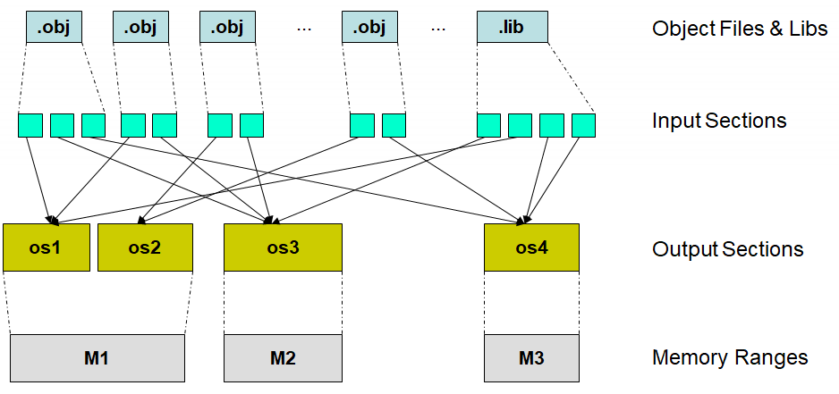

## TI 링커 명령 파일 입문서

### 소개 

이 글은 대부분의 TI 링커 명령 파일에서 흔히 나타나는 코드를 설명합니다. 
[아래 문서를](https://software-dl.ti.com/ccs/esd/documents/sdto_cgt_linker_special_section_types.html) 기반으로 작성되었습니다. 
### 링커 명령 파일을 수정하는 이유

CCS를 설치하고 칩을 선택하는 경우 해당 칩의 링커 명령어 파일을 제공하며, 이는 특별한 이유가 없는 경우 오류 없이 잘 작동합니다. 다만 시스템의 메모리 구성이 변경될 경우 링크 명령어 파일을 변경해야 합니다. 본 문서는 특수한 경우 링커 파일을 수정하는 방법에 대한 간략한 글입니다. 
### 기본사항

링커 명령 파일에는 옵션, 전역 심볼 객체 파일, 라이브러리 등 다양한 항목을 표현할 수 있습니다. 이 문서는 Memory 지시어, 특히 SECTIONS 지시어에 초점을 맞추었습니다. 상세한 링커에 대한 설명은 차후 다른 문서를 통해 정리할 예정입니다. 

### 메모리 지시어

메모리 지시어의 목적은 메모리 범위에 이름을 할당하는 것입니다. 
메모리 범위의 이름은 SECTION 지시어에 안에서 사용됩니다. 
다음은 MSP430 시스템의 메모리 지시어 예시입니다.

```ruby
MEMORY 
{ 
	SFR : origin = 0x0000, length = 0x0010 
	PERIPHERALS_8BIT : origin = 0x0010, length = 0x00F0
	PERIPHERALS_16BIT : origin = 0x0100, length = 0x0100 
	RAM : origin = 0x1C00, length = 0x0FFE 
	INFOA : origin = 0x1980, length = 0x0080 
	INFOB : origin = 0x1900, length = 0x0080 
	INFOC : origin = 0x1880, length = 0x0080 
	INFOD : origin = 0x1800, length = 0x0080 
	FLASH : origin = 0x8000, length = 0x7F80 
	INT00 : origin = 0xFF80, length = 0x0002 /* ... and so on */ 
}
```

>RAM : origin = 0x1C00, length = 0x0FFE 

메모리 이름 *RAM*의 시작 위치는 0x1C00 이며 크기는 0x0FFE 크기를 갖는다는 의미입니다.
이를 통해 우리는 메모리 이름과 시작 위치, 크기를 정의할 수 있으며, 이는 섹션 지시어를 통해 사용됩니다. 
### 섹션 지시어

섹션 지시어에 대부분의 핵심 코드가 포함되어 있습니다. 
가장 중요한 핵심은 섹션 지시어가 아래 두가지 작업을 동시에 수행한다는 것입니다. 
 - 입력 섹션으로부터 출력 섹션 형성
 - 출력 섹션을 메모리에 할당

#### Diagram

해당 그림은 섹션 지시어의 작동 방식을 보여줍니다.



Object 파일에서 입력 섹션을 만들고 이는 출력 섹션으로 연결됩니다. 이를 통해 메모리 영역에 코드를 적절히 옮깁니다.
### Glossary 

섹션 지시어를 이해하기 위해서는 위의 용어들을 이해해야합니다. 

- Object File - 이 글의 객체 파일은 입력 섹션들의 집합, 객체 파일은 링커에게 직접 전달될 수 있으며 (지시어를 통해), 라이브러리에서 가져올 수도 있음
- Input Section - 하나의 객체 파일에서 추출된 하나의 섹션으로 입력 섹션은 초기화 되었거나 되지 않은 상태의 코드 혹은 데이터
- Output Section - 하나 이상의 입력 섹션으로 구성된 집합. 출력 섹션은 섹션 지시어에 이해 형성됨
- Memory Ranges - 메모리 지시어를 통해 지정된 시스템 메모리의 특정 영역

### 섹션 Naming Conventions

이론적으론 입력 섹션의 이름만으로 의미를 알 수 없으나, 관습적으로 아래와 같이 입력 섹션의 이름이 사용됩니다. 

| Name                  | Initialized | Notes                                                                           |
| --------------------- | ----------- | ------------------------------------------------------------------------------- |
| .text                 | yes         | executable code                                                                 |
| .bss                  | no          | global variables                                                                |
| .cinit                | yes         | tables which initialize global variables                                        |
| .data (EABI)          | yes and no  | initialized coming out of the assembler; changed to uninitialized by the linker |
| .data (COFF ABI)      | yes         | initialized data                                                                |
| .stack                | no          | system stack                                                                    |
| .heap or .sysmem      | no          | malloc heap                                                                     |
| .const                | yes         | initialized global variables                                                    |
| .switch               | yes         | jump tables for certain switch statements                                       |
| .init_array or .pinit | yes         | Table of C++ constructors called at startup                                     |
| .cio                  | no          | Buffer for stdio functions                                                      |


**섹션의 이름 시작에 '.'을 붙이는 것은 필수가 아님**

**여기서 초기화는 Linker에 의한 초기화를 의미함, C_init의 초기화와 다름**

### Syntax Note

**SECTIONS** 중괄호 안에 있는 명령어는 모두 섹션 지시어입니다. 
```ruby
SECTIONS 
{ 
	/* all examples appear here */ 
}
```

### 출력 섹션 구성

SECTIONS 지시어 코드에서 가장 헷갈리는 것은 구문 단축어입니다. 
아래는 구문 단축어를 사용하지 않은 지시어입니다. 보통의 경우 구문 단축어를 사용하기 때문에 아래와 같이 모든 의미를 내포하는 경우는 찾기 어렵습니다. 따라서 아래의 구문을 눈여겨 보아야합니다. 
```ruby
SECTIONS 
{ 
    output_section_name         /* Name the output section        */
    {
       file1.obj(.text)         /* List the input sections        */
       file2.obj(.text)
       file3.obj(.text)
    } > FLASH                   /* Allocate to FLASH memory range */
}
```
위 코드는 *ouput_section_name* 라는 output section을 생성합니다.
이 출력 섹션은 *file1.obj* 의 *.text*, *file2.obj* 의 *.text*, *file3.obj* 의 *.text* 라는 3개의 입력 섹션으로 구성되며 output section은 FLASH 메모리 범위에 저장됩니다.

위의 구문에서 Object 파일이 많은 경우 가독성과 확장성이 좋지 않습니다. 
많은 Object 파일에 의해 수많은 입력 센셕이 생성되기 때문입니다.
따라서 아래와 같이 구문을 단축하여 사용합니다. 
```ruby
SECTIONS 
{ 
    output_section_name         /* Name the output section           */
    {
        /* Shortcut syntax for all input sections named .text        */
        *(.text)
    } > FLASH                   /* Allocate to FLASH memory range    */
}
```
위 코드와 이전 코드는 한가지 차이점을 가집니다. 이전 코드는 3개의 입력 섹션과 Object 파일 모두 명시적으로 표현했지만 위의 코드는 *.text* 로 명명된 모든 입력 섹션을 사용합니다.

> "이미 다른 곳에 배치된 것들은 제외하고, 출력 섹션을 찾지 못한 나머지 모든 *.text* 소스들을 여기로 모으겠다"는 의미를 가집니다.

이 조차도 우리가 사용하기에 충분히 짧지 않기 때문에, 아래와 같이 더욱 단축하여 사용합니다. 아래의 구문은 우리가 쉽게 접할 수 있는 섹션 명령어가 되겠습니다. 
``` ruby
SECTIONS 
{ 
	.text > FLASH
}
```
위 코드는 출력 섹션의 이름이 *output_section_name* 에서 *.text* 로 변경되었습니다. 즉 출력 섹션 이름과 입력 섹션 이름이 동일합니다. 

**중요한 것은 이름을 동일하게 단축했지만, 입력 섹션과 출력 섹션은 명백히 구분되어 있다는 것입니다.** 

아래는 또 다른 단축입니다.  
``` ruby
SECTIONS
{
    .text : {} > FLASH
}
```
이전 코드와 의미상 차이는 없지만, 다른 링커 파일에서 흔히 사용되는 형식이기 때문에 추가하였습니다.

아래와 같이 혼합하여 사용할 수도 있습니다.
```ruby
SECTIONS
{
	output_section_name
    {
        first.obj(.text)        /* This code must be first */
        *(.text)
    } > FLASH
}
```
이는 *output_section_name* 의 출력 섹션을 생성하며, 첫번째 입력 섹션은 *first.obj* 파일의 *.text* 섹션이며, 나머지 입력 섹션은 다른 모든 object 파일의 *.text* 섹션입니다.
또한, 이 섹션은 FLASH 메모리 범위에 할당된다는 의미를 가집니다.

###  Output 섹션 메모리 할당

``` ruby
SECTIONS
{
	... > FLASH
}
```
출력 섹션을 메모리에 할당하는 간단한 코드입니다.

``` ruby
SECTIONS
{
    ... > 0x20000000
}
```
위의 코드는 하드코딩된 메모리에 대한 섹션 할당입니다. 
명명된 메모리 범위보다 하드코딩된 메모리에 대한 할당이 항상 먼저 수행됩니다. 

``` ruby
#define BASE 0x20000000

SECTIONS
{
	/* many lines later */

    ... > BASE
}
```
define을 통해 하드코딩된 메모리 범위를 할당할 수도 있습니다.  이는 명명된 메모리 범위가 아닌, 하드코딩된 메모리 범위를 의미합니다. 

### 메모리 범위에 첫 출력 섹션 설정법

아래 코드는 특정 메모리 범위에 출력 섹션을 명시적으로 설정하는 방법입니다. 
```ruby
#define BASE 0x00200000

MEMORY
{
    FLASH : origin = BASE, length = 0x0001FFD4
    ...
}

SECTIONS
{
    .intvecs > BASE    /* only section allocated to BASE */
    .text    > FLASH
    .const   > FLASH
    ...
}
```
이 코드는 *.intvecs*가 FLASH 메모리 영역의 첫 번째 출력 섹션이 되고, 나머지 출력 섹션들이 FLASH 에 배치되는 순서로 동작하도록 작성된 코드입니다. 나머지 순서들은 순차적으로 실행되지만 임의로 할당될 수도 있다는 것에 주의해야 합니다.  

*#define BASE* 는 링커의 C 스타일 전처리 기능의 사용 예시입니다. 이 정의는 FLASH 메모리 범위의 시작점을 설정하는데 사용하지만, *.intvecs* 의 특정 주소를 할당하는데도 사용됩니다. 그렇기에 하드코딩된 주소인 *BASE* 먼저 *.intvecs* 섹션이 먼저 할당됩니다. 

### 여러 메모리 범위 할당

아래의 코드는 여러 메모리 할당에 대한 예시입니다.
```ruby
	.text > FLASH0 | FLASH1
```
이는 *.text* 섹션이 *FLASH0* 혹은 *FLASH1*의 메모리 범위에 할당됨을 의미합니다. 먼저 *FLASH0*에 할당이 시도되며, *FLASH0*에 *.text* 전체를 수용할 수 없는 경우 *FLASH1*에 할당이 시도됩니다. 
주의할 점은 *.text*의 섹션이 분할되지 않는다는 것입니다. 즉, 메모리 범위가 해당 섹션을 수용할 수 없는 경우 섹션이 분할되지 않고 다음 섹션에 할당을 시도합니다.  

아래의 코드는 여러 메모리 범위에 분할 할당의 예시입니다.
```ruby
    .text : >> RAMM0 | RAML0 | RAML1
```
**>>** 구문에 주목해야 합니다. 이는 *.text* 가 해당 메모리 범위에 걸쳐 분할 할당되는 것을 의미하며 *.text* 전체가 *RAMM0*에 들어가지 않으면 분할되어 나머지 부분이 메모리 범위에 할당됩니다. 주의할 점은 분할은 *입력 섹션* 경계에서 발생한다는 것이다. 
**즉 입력 섹션은 절대 분할되지 않습니다.**
이는 함수, 배열, 구조체 등을 중간에 분할할 수 없음을 의미하며, 메모리 범위는 지정된 순서대로 동작합니다. 

### 메모리 페이지

메모리 페이지는 C28XX 링커 명령어 파일에서만 동작하는 특이한 지시어입니다.
```ruby
MEMORY
{
    PAGE 0 :
        RAMM0   : origin = ...
        RAML0L1 : origin = ...

    PAGE 1 :
        RAMM1   : origin = ...
        RAML2   : origin = ...
}
```
각 메모리 페이지는 완전히 독립적이며 페이지 간에는 **서로 같은 메모리 범위 이름과 주소**를 재사용할 수 있습니다.

```ruby
/* DO NOT DO THIS!!! */
MEMORY
{
    PAGE 0 :
        MEM_RANGE : origin = 0x100, length = 0x100
    PAGE 1 :
        MEM_RANGE : origin = 0x100, length = 0x100
}
```
위의 코드는 매우 권장되지 않는 방법이지만 동작합니다. 

이러한 변칙을 허용하는 이유는 C28XXX의 특이한 역사 때문입니다. C28XX 디바이스는 매우 오래된 C2XXX 디바이스 계보에서 시작되었습니다. 초기 디바이스들은 코드와 데이터를 위한 별도의 메모리 버스를 가졌고, 이 버스들은 물리적으로 분리된 메모리 블록에 연결되었습니다. 따라서 *PAGE0*의 특정 주소가 *PAGE1*의 동일한 주소와 다른 내용을 가질 수 있었고, 이론상 C28XX 디바이스에서도 메모리 버스의 이러한 별도 연결이 가능하지만, 거의 사용되지 않는 기능이 되었습니다. 거의 모든 C28XX 디바이스들이 *PAGE*의 구분없이 메모리가 구성되지만, 메모리 페이지를 사용하는 코드들은 여전히 지속되고 있습니다. 그렇기에 링커 명령어 파일이 *PAGE0*, *PAGE1*을 사용하는 경우 그대로 사용하는 것이 가장 좋습니다. 다만, 위의 예제처럼 사용자가 변경하여 사용하는 것은 권장하지 않습니다.

### 출력 섹션 무력화 (Nullify an Output Section, TYPE = DSECT)

``` ruby
	.reset : > RESET, PAGE = 0, TYPE = DSECT    /* not used */
```
위의 코드는 출력 섹션을 더미로 만드는 코드입니다. 
*TYPE = DSECT* 구문을 통해 출력 섹션을 더미로 만듭니다. 
더미 섹션은 메모리 공간을 차지하지 않으며 Output 파일에 존재하지 않습니다. 
결과적으로 *.reset* 으로 명명된 모든 입력 섹션은 경고 없이 무시됩니다. 아무런 경고 없이 참조 문제를 이르킬 수 있기 때문에 사용하기에 적합하지 않습니다. 
위 코드에서 *:* 지시어는 섹션과 메모리 범위를 구분하기 위한 지시어이며, *>* 지시어는 메모리 범위의 *LOAD RUN* 지시어를 축약한 지시어입니다. 
*LOAD RUN* 지시어의 상세한 설명은 아래에서 자세히 설명합니다.  
*DSECT* 와 유사한 특수 섹션에 대한 설명은 [Linker Special Section Types](https://software-dl.ti.com/ccs/esd/documents/sdto_cgt_linker_special_section_types.html)  를 참고하시길 바랍니다. 

### ROM 코드 혹은 데이터 참조 (TYPE = NOLOAD)

```ruby
	FPUmathTables : > FPUTABLES, PAGE = 0, TYPE = NOLOAD
```
위의 코드는 시스템의 메모리 범위에 이미 존재하는 섹션을 참조하는 방법입니다. 
일반적으로 ROM과 FLASH 에 저장된 섹션을 링커에게 전달하는 의미를 가집니다. 이를 통해 사용자는 프로그램(output 파일)에 대용량의 데이터를 직접 넣을 필요 없이 사용할 수 있도록 돕습니다. 
또한, 링커에게는 해당 범위에 데이터가 있다는 것을 알려 다른 데이터를 배치하지 않도록 합니다. 해당 섹션은 외부의 데이터를 참조할 수 없고 외부의 섹션은 *NOLOAD* 된 섹션을 참조할 수 있습니다.   
마찬가지로 *NOLOAD* 와 유사한 특수 섹션에 대한 설명은 [Linker Special Section Types](https://software-dl.ti.com/ccs/esd/documents/sdto_cgt_linker_special_section_types.html)  를 참고하시길 바랍니다. 

### 서로 다른 메모리 범위에서 LOAD, RUN 

```ruby
	.TI.ramfuncs : LOAD = FLASHD,
                RUN = RAML0,
                LOAD_START(_RamfuncsLoadStart),
                LOAD_END(_RamfuncsLoadEnd),
                RUN_START(_RamfuncsRunStart)
```
위 코드는 *.TI.ramfuncs* 출력 섹션을 생성하고 로딩을 위해서 *FLASHD*  할당하고 실행을 위해서 *RAML0* 에 할당하는 예시입니다.
이 출력 섹션은 output 파일에 배치되어 프로그램이 로드될 때 *FLASHD* 메모리 범위에 위치하도록 합니다.  
*.TI.ramfuncs* 의 데이터가 사용되기 전 프로그램을 통해 *FLASHD* 에서 *RAML0* 으로 복사해야 한다는 것에 주의해야합니다.  
**이 복사는 자동적으로 되지 않으며 코드를 통해 명시적으로 복사해야합니다.**  
*.TI.ramfuncs*의 함수를 호출하는 다른 모든 섹션은 *.TI.ramfuncs* 이 이미 *RAML0* 에 있는 것처럼 동작합니다.  
*LOAD_START*, *LOAD_END*, *RUN_START* 지시어를 통해 복사에 필요한 심볼을 생성 할 수 있습니다. 
아래의 코드는 심볼의 C코드 내 사용방법의 예시입니다. 아래와 같이 ramfuncs 섹션 사용 전 해당 메모리 주소로 해당 섹션의 코드를 옮겨야 합니다.  
```c
extern uint32_t _RamfuncsLoadStart;
extern uint32_t _RamfuncsLoadEnd;
extern uint32_t _RamfuncsRunStart;

void copy_sections(void) {
	uint32_t size = (uint32_t)&_RamfuncsLoadEnd - (uint32_t)&_RamfuncsLoadStart;
	memcpy(&_RamfuncsRunStart, &_RamfuncsLoadStart, size);
}
```

### 라이브러리의 입력 섹션 할당

```ruby
   IQmathTables3 : > IQTABLES3
   {
       IQmath.lib<IQNasinTable.obj> (IQmathTablesRam)
   }
```
위 코드는 *IQmathTables3* 출력 섹션을 생성하여 *IQTABLES3* 메모리 범위에 할당합니다. 
이 섹션에는 *IQmathTablesRam* 라는 입력 섹션이 포함되며, 이 입력 섹션은 *IQmath.lib* 라이브러리의 객체 파일 *IQNasinTable.obj* 에서 생성됩니다.

```ruby
    sinetext : > DDR2
    {
         --library=Sinewave_lib.lib(.text)
    }
```
위의 코드처럼 라이브러리의 모든 섹션을 할당할 수도 있습니다. 이 코드는 *sinetext* 출력 섹션을 생성하고 *DDR2* 메모리 영역에 할당합니다. 
여기서 링커는 *Sinewave_lib.lib* 의 모든 파일을 가져오지 않는 점에 유의해야합니다.  
**Open References**, 즉 기존의 코드에서 참조하지 못 한 파일만을 가져옵니다.  
*--library=* 지시어는 이 파일이 현재 폴더에 없으며 라이브러리 경로를 찾도록 링커에게 지시합니다. 이전 예제의 *<>* 지시어는 *--library* 지시어와 같은 효과를 가집니다.

### 그룹 출력 섹션

```ruby
    output_section_1 > RAM
    output_section_2 > RAM
    output_section_3 > RAM
```
위 코드는 *RAM* 메모리 범위에 출력 섹션들을 순차적으로 배치할 수 없습니다. 위에서 설명하였듯이 출력 섹션은 하드코딩된 메모리 범위가 아닌 경우 우선순위가 없어 임의로 배치될 수 있으며, 따라서 중간에 다른 출력 섹션이 배치될 수도 있습니다.  
특정 순서로 출력 섹션을 배치하기 위해서는 *GROUP* 지시어를 사용해야 합니다.

```ruby
    GROUP : > CTOMRAM
    {
        PUTBUFFER
        PUTWRITEIDX
        GETREADIDX
    }
```
출력 섹션은 *PUTBUFFER*, *PUTWRITEIDX*, *GETREADIDX* 입니다. 
출력 섹션의 이름은 관습적으로 소문자를 사용하지만, 그렇지 않는 경우도 있다는 것에 항상 유의해야 합니다. 
이들은 *CTOMRAM* 메모리 범위에 순차적으로 할당됩니다. 주의할 것은 그룹 내의 순서만 보장한다는 것이며 다른 출력 섹션은 메모리 범위에 임의로 그룹과 같이 할당됩니다. 

### 메모리 속성

```ruby
MEMORY
{
    ...
    FLASH1 (RX) : origin = 0x00204000, length = 0x1C000
    FLASH2 (RX) : origin = 0x00260000, length = 0x1FFD0
    CSM_RSVD_Z2 : origin = 0x0027FFD0, length = 0x000C
    CSM_ECSL_Z2 : origin = 0x0027FFDC, length = 0x0024
    C0 (RWX)    : origin = 0x20000000, length = 0x2000
    ...
}
```
*(RX)*, *(RWX)* 와 같은 지시어를 통해 메모리의 속성을 설정합니다. 
기본적으로 메모리는 아래의 4가지 속성을 모두 가집니다.
- R: 읽기 가능
- W: 쓰기 가능
- X: 실행 코드 포함 가능
- I: 초기화 가능 

링커 커맨드 파일에서 이러한 속성은 해당 영역이 어떤 용도로 설계되었는지 명시하는 문서화 용도로 사용되며, 속성의 특성을 강제하지 못 합니다. 

### 마무리
이를 통해 간단히 링커 명령어 파일에 대해 알아보았습니다. 시스템 구성 초기에 간혹 링커 파일을 수정한 경험이 있지만, 
자세히 알지 못하고 사용하였기 때문에 이 글을 작성하게 되었습니다.  
읽어주셔서 감사합니다.

## 참고
- Linker Special Section Types [https://software-dl.ti.com/ccs/esd/documents/sdto_cgt_linker_special_section_types.html](https://software-dl.ti.com/ccs/esd/documents/sdto_cgt_linker_special_section_types.html)
