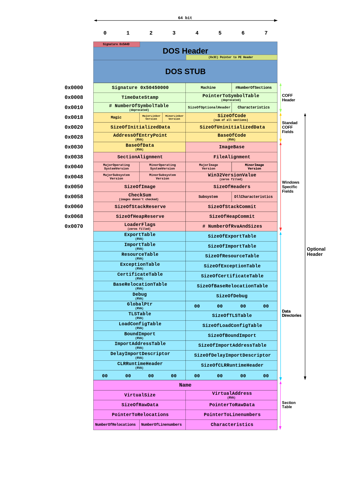

임베디드 Bootloader가 어떤 과정을 거쳐 프로그램을 메모리에 올리는지 공부하다 보면, 자연스럽게 한 가지 의문이 생깁니다. 
**"그렇다면 Windows는 .exe 파일을 어떻게 메모리에 올리는가?"** 
이 의문을 해소하고자 글을 작성하였습니다. 

Bootloader는 정해진 메모리 맵에 따라 바이너리를 적재하고 엔트리 포인트로 점프합니다. Windows 로더도 동일한 역할을 수행하지만, 그 과정을 가능하게 하는 것은 실행 파일 안에 미리 정의된 구조체들입니다. 로더는 이 구조체들을 순서대로 읽으며 "어느 주소에 올릴 것인가", "어디서부터 실행할 것인가", "어떤 외부 함수가 필요한가"를 결정합니다.

이 글은 그 구조체들, 즉 **PE(Portable Executable) 포맷**을 다룹니다. DOS Header에서 시작해 PE Header, Section Header까지, Windows가 .exe 파일을 읽고 메모리에 매핑하는 전체 구조를 순서대로 정리합니다.

아래 그림은 이 글에서 다룰 전체 PE 포멧 구조의 개요입니다.

<small>
출처: 
<a href="https://commons.wikimedia.org/w/index.php?curid=39259242"
   target="_blank"
   rel="noopener noreferrer">
   ByteBiter, CC BY 4.0
</a>
</small>

## 1. PE(Portable Executable) 포맷이란?

Portable Executable이란 **윈도우가 실행 파일을 읽는 설계도** 입니다. 
`.exe` 파일이나 `.dll` 파일은 단순한 프로그램 데이터 덩어리가 아닙니다. 프로그램 호출을 위해서는 윈도우 운영체제가 이 파일을 실행하기 위해 "어디서부터 코드를 읽어야 할지", "어떤 기능을 가져다 쓸지" 등을 미리 약속된 규칙이 필요합니다. 이 규칙을 **PE 포맷**이라고 부릅니다.

* **Portable(포터블):** 여러 종류의 윈도우 환경(32비트, 64비트 등)에서 옮겨 다니며 실행될 수 있다는 뜻
* **Executable(익스큐터블):** 실행 가능한 파일이라는 뜻

## 2. DOS(Disk Operating System) 헤더란?

"왜 윈도우 프로그램 안에 옛날 운영체제인 DOS 이름이 나오지?"라고 생각하실 수 있습니다. 
**'하위 호환성'** 때문입니다.

PE 파일의 맨 앞부분에는 항상 **DOS Header**가 붙어 있습니다. 만약 여러분이 최신 윈도우 게임(.exe)을 아주 옛날 1980년대 DOS 컴퓨터에서 실행하려고 하면, 컴퓨터가 "이게 뭐지?" 하고 당황하지 않게 "이 프로그램은 DOS에서 실행할 수 없습니다"라는 안내 문구를 띄워주기 위해 존재합니다.

1980년대 DOS 시절부터 존재했던 유산으로, 현재의 Windows(NT 계열)에서도 하위 호환성을 위해 반드시 유지하고 있는 64바이트 크기의 구조체입니다.

#### 핵심 구조체 멤버

주요 멤버들은 다음과 같습니다. 

| **필드 명**             | **크기**  | **설명**                                           |
| -------------------- | ------- | ------------------------------------------------ |
| **e_magic**          | 2 bytes | 파일의 시작을 알리는 **'MZ'** (Mark Zbikowski의 약자).       |
| **e_cp**, **e_cblp** | -       | 초기 DOS 시절 메모리 페이지 관련 정보 (현재는 거의 무시됨).            |
| **e_lfanew**         | 4 bytes | 파일 시작점으로부터 **PE Header가 시작되는 위치(Offset)** 를 가리킴. |

---
#### 2.1 DOS Stub
DOS Stub은 **DOS Header(64바이트)** 바로 다음에 위치하며, **PE Header**가 시작되기 전까지의 공간을 의미합니다.

- **호환성:** DOS 환경에서 이 파일을 실행하면, 운영체제는 PE 헤더를 읽지 못하고 오직 앞부분의 DOS Header와 이 **Stub 프로그램**만 인식하여 실행합니다.
- **안내 메세지:** 결과적으로 "이 프로그램은 DOS 모드에서 실행할 수 없습니다"라는 안내를 띄우고 안전하게 종료하게 만드는 것입니다.

##### 2.1.1. 내부 구성

DOS Stub은 실제로는 아주 작은 **16비트 DOS 어셈블리 프로그램**입니다. 보통 다음과 같은 흐름으로 코딩되어 있습니다:

1. 메시지 저장 영역에서 `"This program cannot be run in DOS mode."` 문자열을 가져옴.
2. 화면에 출력하는 DOS 인터럽트 호출.
3. 프로그램 종료.

##### 2.1.2. 크기와 위치

- **시작 지점:** 파일의 `0x40` (64바이트 지점)
- **끝 지점:** `e_lfanew`가 가리키는 PE Header의 시작 직전까지
- **가변적 크기:** 컴파일러마다 Stub의 크기가 다를 수 있습니다. 어떤 컴파일러는 아주 짧게 만들고, 어떤 경우에는 풍부한 정보를 담기도 합니다.

---

## 3. PE Header

`e_lfanew`가 가리키는 오프셋부터 PE Header가 시작됩니다. DOS Header가 파일 식별과 하위 호환성을 담당했다면, PE Header는 Windows 로더가 파일을 메모리에 매핑하기 위해 필요한 모든 정보를 정의하는 영역입니다.

PE Header는 아래 세 구조체가 순서대로 배치된 형태입니다.

각 구조체의 역할은 다음과 같이 구분됩니다.

- **Signature:** 유효한 PE 파일임을 검증하는 매직넘버.
- **File Header:** 대상 아키텍처, 섹션 수, 빌드 타임스탬프 등 파일의 정적 속성.
- **Optional Header:** 엔트리 포인트 주소, ImageBase, 정렬 단위 등 로더가 파일을 메모리에 올리기 위해 직접 참조하는 런타임 정보.

Optional Header는 실행 파일에서는 반드시 존재해야 하며, Windows 로더가 가장 많이 참조하는 구조체입니다.

### 3.1. Signature (4 bytes)

앞의 설명에서 처럼 PE Header에서 가장 먼저 나타나는 데이터입니다. 이 파일이 유효한 PE 파일임을 증명하는 매직넘버 입니다. 

- **값:**  `PE\0\0` (`0x 50 45 00 00`)입니다.

### 3.2. File Header (20 bytes)

파일의 물리적인 특징을 담고 있습니다. `이 파일이 어떻게 설계되었는가`를 알려줍니다.

- **Machine:** 32비트(x86)용인지 64비트(x64)용인지 구분.
- **NumberOfSections:** 파일에 Section이 몇 개나 있는지.
- **TimeDateStamp:** 이 파일이 언제 빌드(컴파일)되었는지.
- **Characteristics:** 실행 파일인지, DLL 파일인지 등의 속성.

### 3.3. Optional Header (가변 크기)

이름은 '선택적(Optional)'이지만, 실제 실행에는 **가장 중요한** 정보들이 들어있습니다. Windows 로더가 파일을 메모리에 올릴 때 이 정보를 참조합니다.

- **Magic:** 32비트(PE32)는 `0x10B`, 64비트(PE32+)는 `0x20B`.
- **AddressOfEntryPoint:** 프로그램이 시작될 때 가장 먼저 실행될 코드의 주소(EP).
- **ImageBase:** 메모리에 로드될 때 희망하는 시작 주소.
- **SectionAlignment / FileAlignment:** 메모리와 파일에서 데이터를 배치하는 간격(단위)

---
### 3.4. Optional Header의 핵심 멤버

Optional Header는 32비트(PE32)와 64비트(PE32+) 버전이 있으며, 구조가 약간 다릅니다. 
#### 3.4.1. Magic (2 bytes)

이 헤더가 32비트용인지 64비트용인지 확인합니다. 

- `0x10B`: PE32 (32-bit)
- `0x20B`: PE32+ (64-bit)

#### 3.4.2. AddressOfEntryPoint (4 bytes)

프로그램이 실행될 때 **가장 먼저 실행될 코드의 주소(EP)** 입니다. 흔히 말하는 `main` 함수로 가기 위한 시작점이며, Relative Virtual Address (RVA) 형태입니다.

#### 3.4.3. ImageBase (4/8 bytes)

파일이 메모리에 로드되기를 원하는 **희망 주소** 입니다. 보통 일반적인 실행 파일(`.exe`)은 `0x400000` (32비트) 또는 `0x140000000` (64비트)를 가집니다.

`ImageBase`는 **가상 주소(Virtual Address)** 를 의미합니다. 물리적인 RAM의 실제 주소가 아니라, 프로세스마다 주어지는 독립된 가상 메모리 공간에서의 주소입니다.

- **고정 값을 가지는 이유** 컴파일러가 코드를 만들 때, 함수 호출이나 변수 참조 주소를 미리 계산해야 하기 때문입니다. 예를 들어 "0x401000에 있는 함수를 실행해"라는 명령을 미리 적어두려면 기준점(`ImageBase`)이 필요합니다.
    
- **프로그램이 메모리에 올라가는 순서**
    
    1. **로더(Loader)의 확인:** Windows 로더가 파일을 읽고 `ImageBase`를 확인합니다.
        
    2. **공간 확보:** 해당 가상 주소에 `SizeOfImage`만큼의 빈 공간을 예약합니다.
        
    3. **ASLR(Address Space Layout Randomization):** 보안을 위해 최신 Windows는 `ImageBase`가 아닌 **랜덤한 주소**에 프로그램을 올리기도 합니다. 이때는 미리 적어둔 주소값들을 새 주소에 맞게 수정하는 **Relocation(재배치)** 과정을 거칩니다

#### 3.4.4. SectionAlignment & FileAlignment

데이터를 배치하는 "단위"입니다.

- **FileAlignment:** 파일 상태에서 데이터를 정렬하는 단위 (보통 512바이트/0x200).
- **SectionAlignment:** 메모리에 올라갔을 때 정렬하는 단위 (보통 4096바이트/0x1000, 즉 1페이지 크기).

여기서 말하는 **정렬(Alignment)** 이란, 데이터를 특정 숫자의 **배수** 위치에 맞추는 것을 의미합니다.

- **File Alignment (파일 정렬):** 하드디스크 내에서 섹션들이 시작되는 규칙입니다. 보통 `0x200` (512바이트)입니다. 만약 코드 섹션의 실제 크기가 100바이트뿐이라도, 파일상에서는 512바이트를 차지하게 됩니다. 나머지 412바이트는 `00`으로 채워집니다. (Zero Padding)
- **Section Alignment (섹션 정렬):** 메모리에 올라갔을 때의 규칙입니다. 보통 `0x1000` (4096바이트, 1페이지)입니다. CPU와 운영체제가 메모리를 관리하는 최소 단위인 '페이지'에 맞춤으로써 메모리 접근 효율을 극대화합니다.
- **이유:** 컴퓨터는 데이터를 1바이트씩 읽는 것보다 정해진 규격(배수)에 맞춰 읽는 것이 훨씬 빠르기 때문입니다. 마치 책꽂이에 책을 꽂을 때, 책 크기와 상관없이 일정한 칸막이 간격을 유지하는 것과 같습니다.
#### 3.4.5. DataDirectory (128 bytes)

Optional Header의 마지막 부분에는 **Data Directory**라는 배열이 있습니다. 여기에는 Export Table(함수 내보내기), Import Table(외부 DLL 가져오기), Resource Table(아이콘, 이미지) 등 테이블들의 위치 정보가 담겨 있습니다.

`DataDirectory`는 16개의 항목으로 구성된 배열입니다. 각 항목은 특정 테이블이 **"어디에(RVA)"**, **"얼마나 크게(Size)"** 있는지 알려줍니다.

##### ① Export Table (내보내기 테이블)

- **역할:** 주로 **DLL(Dynamic Link Library)** 파일에서 사용됩니다.
- **내용:** "우리 DLL에는 `Add()`, `Sub()`라는 함수가 있고, 그 주소는 여기야"라고 외부에 알려주는 목록입니다. 다른 프로그램들이 이 DLL의 기능을 호출 할 때 이 테이블을 참조합니다.

##### ② Import Table (가져오기 테이블)

- **역할:** 프로그램이 실행되기 위해 외부에서 빌려오는 함수들의 목록입니다.
- **내용:** "`kernel32.dll`의 `CreateFile` 함수가 필요해"라고 적어둡니다. 프로그램이 실행될 때 로더가 이 테이블을 보고 필요한 DLL들을 메모리에 함께 올려줍니다.

##### ③ Resource Table (리소스 테이블)

- **역할:** 코드(로직)가 아닌 **데이터**들을 관리합니다.
- **내용:** 프로그램 아이콘, 메뉴 구성, 대화 상자 디자인, 문자열 테이블, 심지어 내장된 이미지나 소리 데이터가 어디에 있는지 정의합니다. 우리가 C# 프로젝트에서 `Resources.resx`에 넣는 파일들이 이곳에 정의됩니다.

## 4. Section Header

PE Header를 통해 로더는 파일의 전반적인 속성과 메모리 매핑 방식을 파악합니다. 그러나 실제 데이터가 파일 내 어느 오프셋에 위치하고, 메모리의 어느 주소에 배치되어야 하는지는 PE Header에 정의되어 있지 않습니다. 이 정보를 담고 있는 것이 **Section Header**입니다.

Section Header는 Optional Header 직후에 위치하며, `NumberOfSections` 값만큼 40바이트 구조체가 연속으로 배열됩니다.

로더는 각 Section Header를 참조하여 다음 두 작업을 수행합니다.

- **파일 데이터 읽기:** `PointerToRawData` 오프셋에서 `SizeOfRawData` 크기만큼 읽는다.
- **메모리 배치:** `VirtualAddress`(RVA)에 해당하는 가상 주소에 매핑하고 `VirtualSize`만큼 공간을 확보한다.

Section Header는 파일상의 오프셋과 메모리상의 RVA를 동시에 보유합니다. 디버거나 PE 분석 도구를 통해 특정 가상 주소가 어느 섹션에 속하는지 판별할 때, 또는 파일 오프셋과 가상 주소를 상호 변환할 때 이 헤더 배열을 기준으로 삼습니다.

각 필드의 세부 구조는 아래에서 설명합니다.
### 4.1. Name (8 bytes)

- **설명:** 섹션의 이름입니다. (예: `.text`, `.data`, `.rsrc`)
- **특징:** ASCII 문자열로 저장되며, 최대 8글자입니다. 만약 이름이 8글자보다 짧으면 남은 공간은 `NULL(\0)`로 채워집니다. 만약 딱 8글자라면 NULL 종료 문자 없이 8바이트를 꽉 채웁니다.

### 4.2. VirtualSize (4 bytes)

- **설명:** 섹션이 **메모리에 로드되었을 때의 실제 크기**입니다.
- **중요성:** 파일에 저장된 크기(`SizeOfRawData`)보다 클 수도 있습니다. 예를 들어, 초기화되지 않은 전역 변수들이 저장되는 `.bss` 섹션은 파일에서는 공간을 차지하지 않지만(0), 메모리에서는 변수들이 들어갈 공간만큼 `VirtualSize`를 가집니다.

### 4.3. VirtualAddress (4 bytes)

- **설명:** 섹션이 메모리에 로드될 때의 시작 주소(**RVA**)입니다.
- **계산:** 실제 메모리 주소는 `ImageBase + VirtualAddress`가 됩니다. 운영체제는 이 주소를 기반으로 섹션을 메모리 페이지에 배치합니다.

### 4.4. SizeOfRawData (4 bytes)

- **설명:** **파일 상태(Disk)** 에서 이 섹션이 차지하는 크기입니다.
- **특징:** 위에서 언급한 `FileAlignment`의 배수가 되어야 합니다. 실제 데이터가 100바이트라도 정렬 단위가 512바이트라면 이 값은 512가 됩니다.

### 4.5. PointerToRawData (4 bytes)

- **설명:** 파일 내부에서 섹션 데이터가 시작되는 **물리적 위치(Offset)** 입니다.
- **활용:** 섹터 데이터의 시작 위치입니다. `FileAlignment`의 배수여야 합니다.

### 4.6. PointerToRelocations (4 bytes)

- **설명:** 해당 섹션의 재배치 정보(Relocation)가 시작되는 파일 오프셋입니다.
- **현재:** 보통 실행 파일(`.exe`)에서는 사용되지 않으며, 주로 목적 파일(`.obj`)에서 사용됩니다. 일반적으로 `0`인 경우가 많습니다.

### 4.7. PointerToLinenumbers (4 bytes)

- **설명:** 디버깅을 위한 줄 번호 정보(Line numbers)가 시작되는 파일 오프셋입니다.
- **현재:** 현대의 디버깅 방식(PDB 파일 등)에서는 거의 사용되지 않아 대부분 `0`입니다.

### 4.8. NumberOfRelocations / NumberOfLinenumbers (각 2 bytes)

- **설명:** 위에 언급한 재배치 항목과 줄 번호 항목의 **개수**입니다. 마찬가지로 실행 파일에서는 대부분 `0`입니다.

### 4.9. Characteristics (4 bytes)

- **설명:** 섹션의 **속성 및 권한**을 나타내는 플래그(Flag) 비트 집합입니다.
- **주요 값 (OR 연산으로 결합):**
    - `0x00000020`: 코드를 포함함 (IMAGE_SCN_CNT_CODE)
    - `0x20000000`: 실행 가능 (IMAGE_SCN_MEM_EXECUTE)
    - `0x40000000`: 읽기 가능 (IMAGE_SCN_MEM_READ)
    - `0x80000000`: 쓰기 가능 (IMAGE_SCN_MEM_WRITE)

## 마무리

이 글에서는 Windows가 `.exe` 파일을 메모리에 올리는 과정을 PE 포맷의 구조를 통해 살펴봤습니다.

**DOS Header**는 파일의 시작점에서 유효성을 검증하고, `e_lfanew`를 통해 PE Header의 위치를 가리킵니다. **PE Header**는 Signature, File Header, Optional Header로 구성되며, 로더가 파일을 메모리에 매핑하기 위한 모든 정보, 즉 엔트리 포인트 주소, ImageBase, 정렬 단위, DataDirectory를 정의합니다. **Section Header**는 각 섹션의 파일 오프셋과 메모리 주소를 동시에 기록하여, 로더가 `.text`, `.data`, `.rsrc` 등의 데이터를 정확한 위치에 배치할 수 있도록 합니다.
결론적으론 임베디드 Bootloader와 큰 차이는 없는 것 같습니다. 아마 다른 운영체제 혹은 다른 시스템에서도 비슷하게 구성되어 있을 것으로 예상됩니다. 
추가적으로 PE 포맷에는 이 글에서 다루지 않은 영역이 존재합니다. Optional Header의 DataDirectory 인덱스 6번은 Debug Directory를 가리키며, 이를 따라가면 PDB 파일의 경로와 GUID가 기록된 RSDS 구조체에 도달합니다. PDB는 PE 파일 외부에 존재하지만 PE 포맷 안에 그 위치가 명시되는 구조입니다. 다만 PDB 내부는 멀티 스트림 기반의 독자적인 포맷으로 구성되어 있어 다루지 않았습니다.

긴 글 읽어주셔서 감사합니다. 
