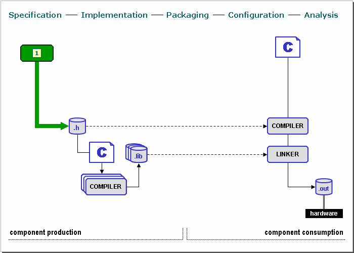
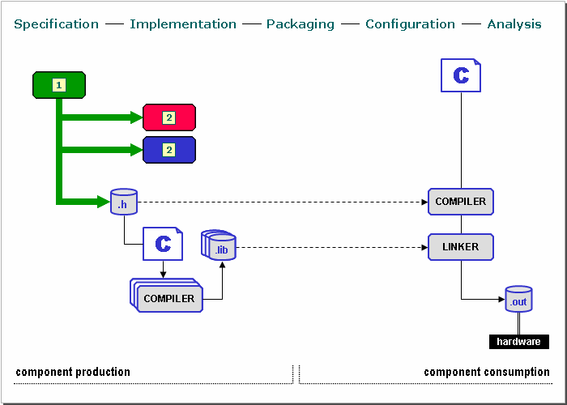
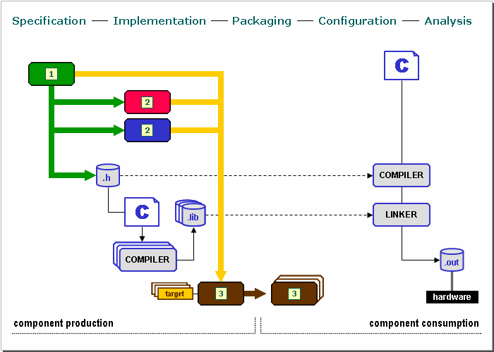
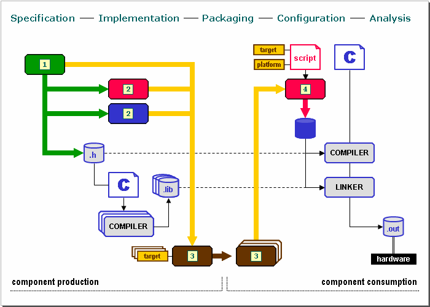
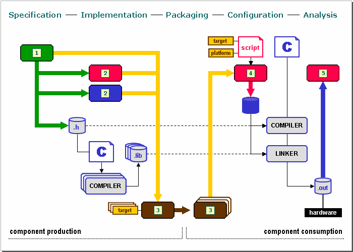
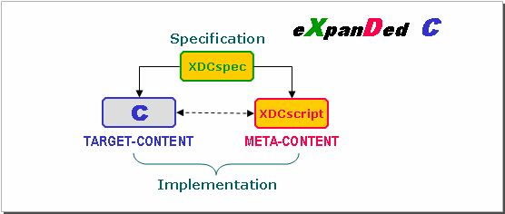

이 글은 TI XDCTools와 SYS/BIOS의 구성을 공부하는 과정에서 시작되었습니다. XDCTools를 학습하던 중 RTSC라는 개념에 대해 궁금해졌고, 이를 정리하기 위해 아래 출처를 기반으로 정리했습니다. 다만, 현재 RTSC 개념은 안타깝게도 개발자들에게 선택 받지 못한 것으로 보입니다.

```
XDCtools를 사용하는 주요 TI DSP 
TMS320C6000 시리즈
TMS320C2000 시리즈
KeyStone 멀티코어 아키텍처
Sitara 프로세서
OMAP/DaVinci 시리즈
```

출처 / Source: [RTSC-Pedia — Introducing RTSC](https://rtsc.eclipse.org/docs-tip/Introducing_RTSC)
# 1. RTSC 배경

## 생산자/소비자 딜레마

임베디드 C 개발자는 소프트웨어의 **생산자(producer)** 이자 **소비자(consumer)** 역할을 동시에 수행합니다.

생산자 입장에서는 비반복 엔지니어링 비용을 줄이기 위해 소프트웨어를 최대한 이식 가능하고 유연하며 범용적으로 만들려 합니다. 생산자의 과제는 단일 코드베이스를 여러 명령어 세트, 여러 툴체인, 여러 애플리케이션 설정에 걸쳐 활용하는 **팬아웃(fan-out)** 관리입니다.

반면 소비자 입장에서는 더 적은 MIPs, 메모리, 전력 소비를 위해 이식성과 범용성의 일부를 포기하고 특정 플랫폼에 최적화된 코드를 선택합니다. 소비자의 과제는 서로 다른 생산자들이 사용하는 다양한 도구, 형식, 기술들을 조화시키는 **팬인(fan-in)** 관리입니다.

이 두 입장의 긴장 관계는 임베디드 소프트웨어가 복잡해질수록 더욱 두드러집니다. 이식 가능한 타입과 함수 이름에서 디렉토리 구조와 버전 호환성에 이르기까지 공통된 기반이 부재할 경우, 콘텐츠 생산자의 수가 몇 명만 되어도 소프트웨어 요소 간 **상호 운용성**은 빠르게 해결하기 어려운 문제로 변합니다.

## 컴포넌트 기술의 가능성과 한계

1990년대 COM과 CORBA를 시작으로, Java나 C# 같은 현대 언어들은 소프트웨어 컴포넌트의 설계, 전달, 배포를 기본적으로 지원합니다. 이를 통해 애플리케이션은 그 어느 때보다 더 모듈화되고, 확장 가능하며, 유연해졌습니다.

그러나 임베디드 환경에서는 이러한 언어와 프레임워크가 유발하는 **런타임 오버헤드**가 지불하기 어려운 비용입니다. 대부분의 임베디드 시스템이 운용되어야 하는 시간, 공간, 전력의 제약을 감안하면, 컴포넌트 기술은 임베디드 C 개발 영역에 거의 영향을 미치지 못했습니다.

결국 임베디드 개발자들은 유연하고 범용적이지만 비효율적인 빌딩 블록과, 
특정 애플리케이션에 최적화되었지만 재사용이 어려운 특화된 요소들 사이의 트레이드오프 문제로 지속적으로 씨름합니다.

## RTSC의 해법

**RTSC** (*릿씨*로 발음, Real-Time Software Components)는 이 딜레마를 해결하기 위해 등장했습니다. ANSI C 컴파일러만으로 동작하며, 현대적인 프로그래밍 관행에 부합하는 **보완적인 도구와 인프라**를 C 언어에 도입합니다.

핵심은 **추가적인 런타임 오버헤드 없이** 더 모듈화되고 확장 가능하며 유연한 임베디드 소프트웨어 생산을 가능하게 한다는 점입니다. 단순히 C를 더 잘 활용하는 방법으로서, 임베디드 C 프로그래밍 세계의 생산자와 소비자 사이에 공통된 기반을 확립합니다.

2008년 4월, RTSC 프로젝트는 **eclipse.org**의 창설 심사를 통과하여 오픈소스 커뮤니티에 합류했습니다. 처음에는 Texas Instruments가 개발하여 여러 주력 제품에서 사용 중인 이 기술을, 앞으로는 어떤 하드웨어 플랫폼을 대상으로 하는 임베디드 개발자들도 폭넓게 활용할 수 있도록 확장해 나가고 있습니다. ( *...라고 출처에서 이야기하지만, 현재는 TI에서도 비교적 오래된 칩에서만 적용되었던 개념이며 최신 칩에는 적용하지 않고 있습니다.* )

# 2. RTSC의 5단계 흐름 (생산자에서 소비자로)

RTSC는 C로 구현된 임베디드 소프트웨어 컴포넌트의 라이프사이클 전반에 걸쳐, 컴포넌트 생산에서 소비까지 이어지는 **5단계 흐름**을 명확히 하는 도구와 인프라를 도입합니다.


출처 / Source: [RTSC-Pedia — Introducing RTSC](https://rtsc.eclipse.org/docs-tip/Introducing_RTSC)

각 단계를 살펴볼 때 중요한 점은, C 라이브러리와 프로그램을 컴파일하고 링크하는 기존의 익숙한 과정은 그대로 유지된다는 것입니다. RTSC는 C를 대체하는 것이 아니라, C를 활용하고 향상시키는 것을 목표로 합니다.

## 2.1 명세 (Specification)


출처 / Source: [RTSC-Pedia — Introducing RTSC](https://rtsc.eclipse.org/docs-tip/Introducing_RTSC)

명세의 목적은 **서로 다른 생산자가 만든 컴포넌트들을 소비자가 자유롭게 혼합하고 대체할 수 있도록**, 컴포넌트 간의 프로그래밍 경계를 공식적으로 정의하는 것입니다.

C 헤더만으로는 이를 충분히 표현하기 어렵기 때문에, RTSC는 **C 유사 명세 언어(spec language)** 를 별도로 도입합니다. 이 언어로 작성된 명세로부터 생산자와 소비자 모두가 사용하는 C `.h` 파일이 자동으로 생성됩니다.

RTSC 명세 언어는 C에서 직접 지원되지 않는 세 가지 핵심 프로그래밍 구조를 제공합니다.

- **module**: 공개 명세와 비공개 구현을 갖는 상수, 타입, 함수들의 응집된 집합
- **interface**: 다른 인터페이스가 상속하고 모듈이 궁극적으로 구현하는 추상 명세
- **package**: 모듈과 인터페이스를 포함하는 상위 수준의 네임스페이스

Java나 C# 같은 현대 언어들은 이미 이와 유사한 고수준 구조를 언어 차원에서 지원하기 때문에 별도의 명세 언어가 필요하지 않습니다. RTSC의 명세 언어는 그러한 구조를 C 환경에서 사용할 수 있도록 도입한 것입니다.

## 2.2 구현 (Implementation)


출처 / Source: [RTSC-Pedia — Introducing RTSC](https://rtsc.eclipse.org/docs-tip/Introducing_RTSC)

명세가 완성되면, 생산자로서 우리가 해당 명세를 기반으로 모듈을 직접 구현할 수 있습니다. 구현은 C로 작성하는 것이 기본이며, 필요에 따라 C++ 또는 어셈블리도 사용할 수 있습니다.

생산자가 작성하는 RTSC 모듈 구현은 서로 보완하는 두 가지 도메인으로 나뉩니다.

- **타겟 구현 (target-implementation)**: 임베디드 하드웨어에서 실행될 C 코드. 자원이 제한된 타겟 환경에서 동작합니다.
- **메타 구현 (meta-implementation)**: 타겟 프로그램의 설정과 분석을 안내하는 고수준 코드. 자원이 풍부한 호스트 PC에서 실행됩니다.

무거운 처리는 호스트의 메타 구현이 담당하고, 타겟에서는 꼭 필요한 C 코드만 실행하게 함으로써, 런타임 오버헤드 없이 고수준 프로그래밍을 실현한다는 RTSC의 핵심 목표를 달성합니다. 메타 구현을 위해 RTSC는 **JavaScript** 기반의 전용 메타 언어(XDCscript)를 제공합니다.

## 2.3 패키징 (Packaging)


출처 / Source: [RTSC-Pedia — Introducing RTSC](https://rtsc.eclipse.org/docs-tip/Introducing_RTSC)

RTSC 패키지는 **논리적 네임스페이스**이자 동시에 **실제 파일 시스템 디렉토리**입니다. 명세 파일, 헤더, 라이브러리, 스크립트, 문서 등 컴포넌트 생산에 관련된 모든 산출물을 하나의 디렉토리에 담으며, 빌드·배포·설치의 전 과정에서 **분리할 수 없는 하나의 단위**로 취급됩니다.

생산자 관점에서 패키징의 핵심은 **팬아웃 문제 해결**입니다. RTSC는 **타겟(target)** 이라는 추상화를 도입합니다. 타겟은 특정 컴파일러 툴체인으로 특정 명령어 세트와 메모리 모델에 맞게 C 소스를 컴파일하는 레시피입니다. 이를 활용하면 동일한 소스를 C6000, ARM 등 여러 플랫폼용 라이브러리로 한 번에 빌드할 수 있습니다.

소비자 관점에서는 RTSC 패키지를 **전달의 표준 단위**로 삼음으로써 팬인 문제를 완화합니다. RTSC는 Java를 모델로 한 3단계 배치 구조를 표준으로 정의합니다.

- **패키지 디렉토리 (package directory)**: 패키지명과 상대 경로가 일치하는 디렉토리
- **패키지 저장소 (package repository)**: 패키지 디렉토리들을 모아두는 상위 디렉토리
- **패키지 경로 (package path)**: 패키지를 탐색하는 저장소들의 순서 있는 목록

이 구조를 공통 기반으로 삼음으로써, 자동화 도구가 배치된 패키지들의 완전성과 일관성을 검증할 수 있고 생산자에서 소비자로의 흐름이 더 원활해집니다.
#### 소비자가 패키지에 접근하는 방법

RTSC는 패키지 경로를 `$XDCPATH;$XDCROOT/packages;^` 형태로 정의합니다. 여기서 `XDCPATH`는 사용자가 설정하는 저장소 목록, `XDCROOT`는 XDCtools 설치 디렉토리, `^`는 현재 패키지의 저장소를 의미합니다. [Texas Instruments](http://downloads.ti.com/dsps/dsps_public_sw/sdo_sb/targetcontent/rtsc/3_20_00_41/exports/docs/rtscpedia/Glossary/Glossary.html)

패키지 탐색은 세 가지 개념으로 이루어집니다.

```
패키지 경로 (Package Path) = XDCPATH 목록
  └── 패키지 저장소 (Package Repository) = 여러 패키지가 모인 디렉토리
        └── 패키지 디렉토리 (Package Directory) = 패키지명과 경로가 일치하는 디렉토리
```

실제 디렉토리 구조 예시입니다.

```
C:/
├── xdctools/              ← XDCtools 설치 디렉토리 ($XDCROOT)
│   └── packages/          ← XDCtools 기본 저장소 (항상 포함)
│       └── xdc/runtime/   ← xdc.runtime 패키지 디렉토리
│
├── sysbios/               ← SYS/BIOS 설치 디렉토리
│   └── packages/          ← SYS/BIOS 저장소 → XDCPATH에 추가 필요
│       └── ti/sysbios/knl/  ← ti.sysbios.knl 패키지 디렉토리
│
└── myproject/
    └── src/               ← 내 패키지 저장소
        └── com/myco/      ← com.myco 패키지 디렉토리
```

`XDCPATH`는 세미콜론으로 구분된 저장소 디렉토리 목록이며, SYS/BIOS 같은 외부 제품을 사용하려면 해당 패키지가 설치된 저장소 경로를 `XDCPATH`에 추가해야 합니다. 

소비자는 `.cfg` 설정 스크립트 안에서 패키지를 **이름으로만** 참조합니다. 이 덕분에 스크립트가 디렉토리 위치에 종속되지 않고 이식성을 가집니다. 

```javascript
/* app.cfg — 소비자는 경로가 아닌 패키지 이름으로 모듈을 참조 */
var Task      = xdc.useModule('ti.sysbios.knl.Task');   // ti/sysbios/knl 에서 탐색
var Clock     = xdc.useModule('ti.sysbios.knl.Clock');
var System    = xdc.useModule('xdc.runtime.System');    // xdc/runtime 에서 탐색
```

```c
/* main.c — C 소스에서도 패키지 경로 구조 그대로 헤더를 참조 */

#include <ti/sysbios/knl/Task.h>   // 패키지명이 그대로 include 경로
#include <xdc/runtime/System.h>
```

`XDCPATH`를 변경하면 기존 패키지를 교체하는 효과를 낼 수 있고, 문제가 생기면 경로에서 제거하는 것만으로 즉시 이전 버전으로 되돌릴 수 있습니다.

## 2.4 설정 (Configuration)


출처 / Source: [RTSC-Pedia — Introducing RTSC](https://rtsc.eclipse.org/docs-tip/Introducing_RTSC)

설정 단계는 소비자 관점에서 **컴포넌트 통합의 핵심**입니다. 여러 생산자가 패키징하여 전달한 타겟 콘텐츠 요소들을 결합하고 조립하여, 특정 하드웨어 플랫폼에서 실행될 하나의 애플리케이션으로 만드는 과정입니다.
### 설정 시작: 메타 프로그램 (.cfg)

설정은 RTSC **메타 언어(XDCscript)** 로 작성된 **설정 스크립트(.cfg)** 로 시작합니다. 이 스크립트는 애플리케이션의 **메타 프로그램**으로, 타겟 프로그램에 포함될 각 모듈을 식별하고 그 동작을 조정하는 역할을 합니다. 소비자는 여기서 RTSC **타겟(target)** 과 **플랫폼(platform)** 도 함께 지정하며, 이는 타겟 콘텐츠를 컴파일하고 링크하는 방법을 결정하는 레시피로 활용됩니다.

### 설정 파라미터: 메타 도메인의 변수 → 타겟 도메인의 상수

설정의 가장 독특한 특징은 **설정 파라미터(config parameter)** 의 동작 방식입니다.

- **메타 프로그램**: 읽기/쓰기가 가능한 변수처럼 자유롭게 값을 할당할 수 있습니다.
- **타겟 프로그램**: 빌드 시점에 값이 확정되어 **읽기 전용 상수(extern const)** 로 변환됩니다.

범용적으로 설계된 모듈을 수정 없이 특정 애플리케이션에 맞게 "특화"시킬 수 있으며, 런타임 오버헤드도 발생하지 않습니다. 최종적으로 우리는 코드상에서 아래와 같이 접근할 수 있습니다. 

```c
/* configPkg/package/cfg/app_p64.c — xdc가 자동 생성한 파일, 직접 편집 불가 */

/* .cfg에서 할당한 값이 빌드 시점에 상수로 확정됨 */
const ti_sysbios_knl_Task_SizeT ti_sysbios_knl_Task_defaultStackSize__C = 4096;
```

### 설정 완료 후: 생산자 메타 콘텐츠의 자동 개입

소비자의 설정 스크립트 실행이 끝나면, 애플리케이션에 포함된 모든 RTSC 패키지의 **메타 콘텐츠**가 설정 마지막 단계에서 자동으로 호출됩니다. 이 단계에서 **생산자**의 메타 콘텐츠는 다음과 같은 방식으로 설정 과정에 **능동적으로 참여**합니다.

- 다른 RTSC 모듈을 추가로 가져오고 해당 설정 파라미터를 자동 할당
- 현재 설정에 문제가 있는 경우 오류 또는 경고를 발생 및 조기 탐지
- 해당 프로그램과 플랫폼에 최적화된 **링커 명령 파일** 자동 생성
- 설정 과정에서 수집된 정보를 바탕으로 **C 코드를 자동 합성**

RTSC 설정이 가져오는 가장 큰 변화는 **자동화**입니다. 과거에는 소비자가 생산자가 제공한 링커 명령 파일이나 C 초기화 코드를 직접 손으로 편집해야 했습니다. RTSC는 이 과정 전체를 자동화하여, 소비자가 `.cfg` 파일에서 모듈과 파라미터를 선언하는 것만으로 나머지 통합 작업이 처리되도록 합니다.

이 자동화의 핵심 이점은 **오류의 조기 탐지**입니다. 호스트 PC의 충분한 자원을 활용해 타겟 콘텐츠가 실제 하드웨어에서 실행되기 전에 메타 콘텐츠를 먼저 실행함으로써, 잘못된 설정이 모호한 컴파일러/링커 오류나 런타임의 치명적 오류로 이어지기 전에 설정 단계에서 미리 잡아낼 수 있습니다.
## 2.5 분석 (Analysis)


출처 / Source: [RTSC-Pedia — Introducing RTSC](https://rtsc.eclipse.org/docs-tip/Introducing_RTSC)

분석 단계는 설정 단계에서 그치지 않고, 생산자가 제공한 메타 콘텐츠가 **프로그램 실행 중, 혹은 종료 후에도** 모듈의 동작을 능동적으로 분석하는 단계입니다.

RTSC 분석 도구는 호스트 기반 디버거나 프로그램 상태 스냅샷을 통해 타겟의 데이터 메모리를 읽어옵니다. 이후 모듈의 타겟 구현 상태 구조를 JavaScript 객체로 디코딩하고, 동일 모듈의 메타 구현을 호출하여 그 상태를 사람이 이해하기 쉬운 형태로 변환합니다.

상태 조회와 함께, 분석의 또 다른 축은 **이벤트 스트림 분석**입니다. RTSC가 제공하는 `Log` 모듈을 사용하면 생산자와 소비자 모두 C 코드 어느 위치에서나 타임스탬프가 붙은 이벤트를 발생시킬 수 있습니다. 이 이벤트들은 타겟 메모리에 보관하거나, 하드웨어 출력 장치를 통해 실시간으로 호스트에 전송할 수 있습니다. 이벤트 로깅의 활성화 수준은 설정 파라미터를 통해 모듈별 또는 프로그램 전체 단위로 제어할 수 있으며, 빌드 시점에 고정하거나 런타임 플래그로 동적으로 조정하는 것도 가능합니다.

### `Log` 모듈로 이벤트 기록하기

분석 단계의 가장 기본적인 사용법은 `Log` 모듈로 이벤트를 발생시키고, CCS의 **ROV(Runtime Object Viewer)** 로 확인하는 것입니다.

#### 예시: 커스텀 이벤트 정의와 기록

생산자가 모듈에 이벤트를 정의하고, 소비자가 `.cfg`에서 이를 활성화하는 방법입니다.

**1. 모듈 명세 (Mod.xdc)** — 생산자가 이벤트를 정의

```c
import xdc.runtime.Diags;
import xdc.runtime.Log;

config Log.Event L_someEvent = {
    mask: Diags.USER1 | Diags.USER2,
    level: Diags.LEVEL1,
    msg: "my log event message, arg1: 0x%x, arg2: 0x%x"
};
```
`USER1` 또는 `USER2` 비트 중 하나라도 설정되어 있으면 이 이벤트가 발생합니다.

**2. 타겟 구현 (Mod.c)** — 이벤트 발생 지점

```c
#include <xdc/runtime/Log.h>

UInt x, y;
Log_write2(Mod_L_someEvent, (IArg)x, (IArg)y);
```

**3. 설정 파일 (app.cfg)** — 소비자가 활성화 수준과 Logger를 지정

```javascript
var Diags     = xdc.useModule('xdc.runtime.Diags');
var LoggerSys = xdc.useModule('xdc.runtime.LoggerSys');
var Mod       = xdc.useModule('my.pkg.Mod');

Mod.common$.diags_USER1 = Diags.ALWAYS_ON;
Mod.common$.logger      = LoggerSys.create();
```

`ALWAYS_ON`으로 설정된 이벤트는 빌드 시점에 활성화가 확정되며, `LoggerSys`가 이벤트를 수신하여 `System_printf()`로 출력합니다. 이 `.cfg` 설정이 없으면 `Log_write2()` 호출이 코드에 존재하더라도 이벤트는 발생하지 않습니다.

---
> 출처: [xdc.runtime.Log — CDOC](https://software-dl.ti.com/dsps/dsps_public_sw/sdo_sb/targetcontent/sysbios/6_52_00_12/exports/bios_6_52_00_12/docs/cdoc/xdc/runtime/Log.html)
### 예시: SYS/BIOS Task Package

**1. 명세 파일 (Task.xdc)** — `Task.xdc`는 `ti.sysbios.knl` 패키지 안에 위치하며, Task 모듈이 독립적인 실행 스레드를 표현하고 프로세서를 전환함으로써 병렬 실행을 구현한다고 명세합니다. 

```javascript
/* Task.xdc — ti.sysbios.knl 패키지의 명세 파일 */
package ti.sysbios.knl;

import xdc.runtime.Error;
import xdc.runtime.IHeap;

module Task {

    /* 모듈 전체 설정 파라미터 */
    config Int numPriorities = 16;   // 태스크 우선순위 단계 수
    config SizeT defaultStackSize;   // 기본 스택 크기

    /* 인스턴스 생성 함수 */
    create(FuncPtr fxn, params);

    /* 인스턴스별 설정 파라미터 */
    instance:
        config Int    priority    = 1;      // 태스크 우선순위
        config SizeT  stackSize   = 0;      // 스택 크기 (0 = 기본값)
        config String instance.name = "";   // 디버깅용 이름

    /* 공개 함수 선언 */
    Void  sleep(UInt32 nticks);   // 지정 틱만큼 대기
    Void  yield();                // 동일 우선순위 태스크에 양보
    UInt  disable();              // 태스크 스케줄러 비활성화
    Void  restore(UInt key);      // 태스크 스케줄러 복원
    Int   getPri(Handle handle);  // 우선순위 조회
    Void  setPri(Handle handle, Int newpri);  // 우선순위 변경
};
```

**2. 메타 구현 — 소비자 설정 파일 (.cfg)** — 실제 SYS/BIOS 예제에서 소비자는 `.cfg` 파일에서 `xdc.useModule`로 Task, Clock, Semaphore 등 필요한 모듈을 선언하여 사용합니다. 

```javascript
/* app.cfg — 소비자가 작성하는 설정 파일 (메타 도메인, 호스트에서 실행) */
var Task = xdc.useModule('ti.sysbios.knl.Task');

/* 모듈 전체 파라미터 설정 */
Task.defaultStackSize = 2048;   // 기본 스택 2KB
Task.numPriorities    = 16;     // 우선순위 16단계

/* 정적 태스크 생성 — 빌드 시점에 확정됨 */
var taskParams = new Task.Params();
taskParams.instance.name = "myTask";
taskParams.stackSize     = 4096;
taskParams.priority      = 5;
Program.global.task0 = Task.create('&myTaskFxn', taskParams);
```

**3. 타겟 구현 — C 코드 (target-domain)** — 소비자는 `<ti/sysbios/knl/Task.h>`를 include하여 Task API를 사용하며, `Task_create`, `Task_sleep`, `Task_setPri` 등 `ModuleName_functionName` 형태의 C 함수를 호출합니다.

```c
/* main.c — 타겟 하드웨어에서 실행되는 C 코드 */
#include <xdc/std.h>
#include <xdc/runtime/System.h>
#include <ti/sysbios/knl/Task.h>
#include <ti/sysbios/BIOS.h>

/* 태스크 함수 본체 */
Void myTaskFxn(UArg arg0, UArg arg1)
{
    while (1) {
        System_printf("Task running\n");
        Task_sleep(100);   // 100 틱 대기 → Task_yield 없이 블로킹
    }
}

Int main()
{
    /* .cfg에서 정적 생성하지 않고 런타임에 동적 생성하는 경우 */
    Task_Params taskParams;
    Task_Params_init(&taskParams);   // 기본값으로 초기화
    taskParams.stackSize = 4096;
    taskParams.priority  = 5;
    Task_create(myTaskFxn, &taskParams, NULL);

    BIOS_start();   // 스케줄러 시작
    return 0;
}
```

# 3. 5단계를 완성하는 XDCtools
RTSC의 5단계 흐름 전체를 지원하는 도구와 인프라는 **XDCtools** 라는 단일 제품 안에 포함되어 있습니다.

## 3.1. eXpanDed C: 언어 지원의 핵심

XDCtools는 두 가지 언어를 표준 C와 결합합니다.


출처 / Source: [RTSC-Pedia — Introducing RTSC](https://rtsc.eclipse.org/docs-tip/Introducing_RTSC)

- **XDCspec (명세 언어):** `.xdc` 파일에서 module, interface, package 같은 고수준 구조를 정의합니다. 컴파일러가 직접 이해하는 언어가 아니며, XDCtools가 이를 읽어 C 헤더(`.h`)를 자동 생성합니다.
- **XDCscript (메타 언어):** JavaScript 기반으로, 호스트 PC에서 실행됩니다. `.cfg` 설정 파일 작성과 메타 구현(`Talker.xs` 등)이 모두 이 언어로 작성됩니다.
- **ANSI C (타겟 구현):** 임베디드 하드웨어에서 실제로 실행되는 코드입니다. XDCtools는 특정 컴파일러를 번들로 제공하지 않으며, **RTSC 타겟(target)** 이라는 표준화된 레시피를 통해 수십 가지 벤더의 C 컴파일러를 지원합니다.

세 요소의 관계를 정리하면 이렇습니다.

```
XDCspec (.xdc)    → 명세 정의    → C 헤더 자동 생성
XDCscript (.cfg)  → 설정/메타    → 호스트에서 실행
ANSI C (.c)       → 타겟 구현   → 임베디드 하드웨어에서 실행
```

이 세 가지를 합쳐 RTSC에서는 _**eXpanDed C**_ 라고 부릅니다.

## 3.2. 핵심 패키지 (Core Packages)

XDCtools는 100개 이상의 RTSC 패키지로 구성되며 크게 세 그룹으로 나뉩니다.

**package life-cycle:** 다른 RTSC 패키지의 빌드·배포·설치 라이프사이클을 지원합니다. RTSC 패키지 자체가 이 패키지들로 관리됩니다.

**program life-cycle:** RTSC 프로그램의 설정·실행·분석 라이프사이클을 지원합니다. 앞서 설명한 5단계 흐름이 이 그룹의 메타 콘텐츠를 기반으로 동작합니다.

**program run-time:** 실행 가능한 C 프로그램에 필요한 기본 런타임을 제공합니다. 이 그룹의 핵심이 바로 **`xdc.runtime`** 패키지입니다.

#### xdc.runtime 패키지

이식 가능한 ANSI C로 구현되어 소스가 공개된 패키지로, 임베디드 C 프로그램에 필요한 기본 서비스를 모듈 단위로 제공합니다.

|모듈|역할|
|---|---|
|`Log`|런타임 이벤트 기록. `Log_write()`, `Log_info()` 등|
|`Diags`|모듈별 진단 마스크 제어. 로깅 활성화 수준 결정|
|`LoggerBuf`|이벤트를 순환 버퍼에 저장. 실시간 고속 환경에 적합|
|`LoggerSys`|이벤트를 `System_printf()`로 즉시 출력. 초기 개발에 적합|
|`Error`|오류 발생 및 처리|
|`Memory`|플러그 가능한 메모리 할당자 인터페이스|
|`System`|프로그램 시작/종료, 표준 출력 지원|

앞서 분석 단계에서 살펴본 `Log` 모듈 예시가 바로 이 `xdc.runtime` 패키지 안에 속합니다.

---
## 3.3. 필수 유틸리티

|명령/유틸리티|설명|
|---|---|
|`xdc`|여러 타겟에 대한 패키지 빌드 및 배포|
|`xs`|XDCscript로 작성된 도구 호출|
|`xdc.tools.configuro`|기존 빌드 흐름에 `.cfg` 설정을 통합|
|`xdc.tools.cdoc`|XDCspec 소스로부터 문서 자동 생성|
|`xdc.tools.repoman`|패키지 저장소 관리|
|`xdc.tools.path`|패키지 경로(XDCPATH) 관리|

이 유틸리티들 자체도 XDCspec과 XDCscript로 구현된 완전한 RTSC 패키지입니다. 즉, 누구든지 새로운 패키지를 만들어 XDCtools 생태계에 도구를 추가할 수 있습니다.

결국 XDCtools가 제시하는 방향은 단순합니다. C를 대체하지 않고, C 위에 생산자와 소비자가 공유할 수 있는 공통 기반을 얹는 것입니다.

# 마치며

RTSC는 임베디드 소프트웨어의 고질적인 문제, 즉 생산자와 소비자 사이의 공통 기반 부재를 해결하려 한 개념적으로 의미 있는 시도였습니다. 컴포넌트 단위 관리, 정적 설정 기반 빌드, 런타임 오버헤드 없는 고수준 프로그래밍이라는 목표는 지금 봐도 타당합니다.

그러나 실제 생태계 확장은 거의 이루어지지 않았습니다. 이유는 명확합니다. RTSC 생태계 자체가 SYS/BIOS, TI-RTOS 등 TI 플랫폼 중심으로 설계되어 있어 다른 벤더가 채택할 동기가 없었고, `.xdc`, `.xs`, `.cfg`, `package.xdc`로 이어지는 학습 곡선은 `C + Makefile`에 익숙한 임베디드 개발자에게 높은 진입 장벽이었습니다. 결과적으로 RTSC는 2008년 Eclipse Foundation에 합류했음에도 불구하고 업계 표준으로 자리잡지 못하고 사실상 TI 내부 도구로 남았습니다.

RTSC가 시도한 컴포넌트 기반 펌웨어 관리나 설정 기반 빌드라는 개념은 이후 다른 형태로 이어졌다고 합니다. 이 부분은 추후 더 공부해 볼 주제로 남겨두겠습니다. 
```
컴포넌트 기반 펌웨어 - Zephyr modules, CMSIS packs, ESP-IDF components
설정 기반 RTOS 빌드 - Kconfig, device tree
```

RTSC를 공부한 이유는 단순히 TI 툴을 이해하기 위해서였지만, 결과적으로 임베디드 소프트웨어 생태계가 어떤 문제를 오랫동안 풀려고 했는지를 함께 볼 수 있었습니다.

### 출처
- RTSC-Pedia, Introducing RTSC [https://rtsc.eclipse.org/docs-tip/Introducing_RTSC](https://rtsc.eclipse.org/docs-tip/Introducing_RTSC)
- TI Glossary [http://downloads.ti.com/dsps/dsps_public_sw/sdo_sb/targetcontent/rtsc/3_20_00_41/exports/docs/rtscpedia/Glossary/Glossary.html](http://downloads.ti.com/dsps/dsps_public_sw/sdo_sb/targetcontent/rtsc/3_20_00_41/exports/docs/rtscpedia/Glossary/Glossary.html)
- xdc.runtime.Log CDOC [https://software-dl.ti.com/dsps/dsps_public_sw/sdo_sb/targetcontent/sysbios/6_52_00_12/exports/bios_6_52_00_12/docs/cdoc/xdc/runtime/Log.html](https://software-dl.ti.com/dsps/dsps_public_sw/sdo_sb/targetcontent/sysbios/6_52_00_12/exports/bios_6_52_00_12/docs/cdoc/xdc/runtime/Log.html)